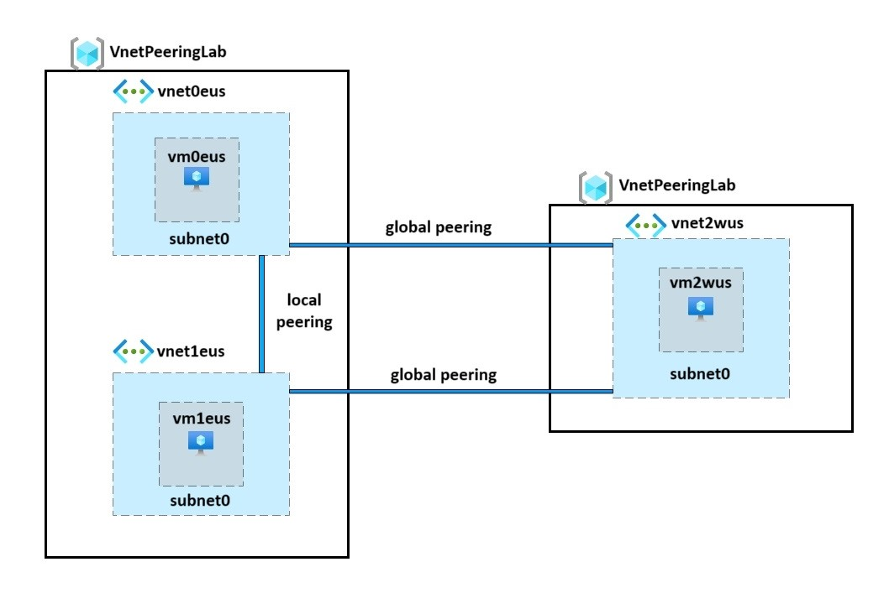

# Implement Intersite Connectivity Lab
Bicep Deployment for implementing intersite connectivity lab utilizing virtual network peering.

## Architecture

### How it Works

This architecture contains 3 virtual networks with a single subnet hosting a vm resource. Vnet0eus and Vnet1eus are both located in the east us location, while Vnet2wus is hosted in the west us location. The 2 vnets in the East US are connected through local peering while the connections between the 2 vnets in the East US are both sepereately peered to the network in the West US region are peered through global peering, ensure that all vms are able to conect and communicate with each other. 